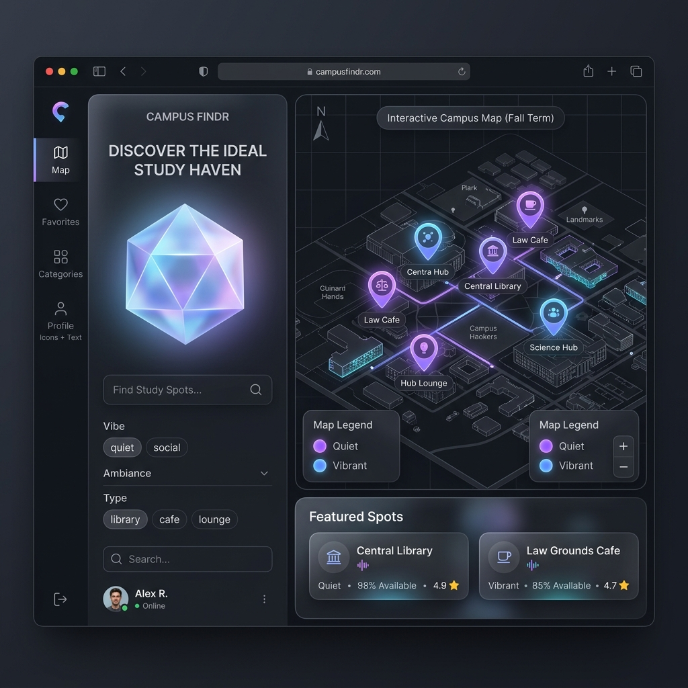

<div align="center">
  <br />
  <h1>🎓 Campus Study Spot Finder</h1>
  <p>
    <strong>A full-stack, AI-ready web application designed to help university students discover and rate the optimal studying environments based on real-time noise levels, Wi-Fi speed, and crowdedness.</strong>
  </p>
  
  <h3>🚀 <a href="https://smart-campus-mapper.vercel.app/" target="_blank">View Live Demo</a></h3>
  <br />
  
  <br />
  <p>
    Built with Next.js, PostgreSQL, Prisma, Leaflet, and React Three Fiber.
  </p>
</div>

<br />

## 🌟 Overview
Finding the perfect place to study on a large university campus can be frustrating. This application solves that problem by crowdsourcing data to help students find optimal environments tailored to their immediate needs. Whether you need pin-drop silence with fast Wi-Fi for an online quiz, or a bustling cafe with accessible outlets for a group project, this platform maps it all.

This project was built to demonstrate proficiency in modern full-stack web development, 3D interactive UI design, and relational database management.

## ✨ Technical Features
- **Premium 3D User Interface**: Implemented an immersive, glassmorphic UI featuring a dynamic 3D background using `Three.js` and `@react-three/fiber` to maximize user engagement.
- **Interactive Mapping System**: Integrated `Leaflet` and `OpenStreetMap` with custom dark-mode tile filters to plot study locations dynamically.
- **Robust Relational Database**: Designed a normalized schema using `PostgreSQL` and `Prisma ORM` to handle one-to-many relationships between Study Spots and User Ratings.
- **Server-Side Rendering (SSR)**: Leveraged the `Next.js` App Router to ensure fast page loads, optimal SEO, and secure server-side API interactions.
- **Responsive & Accessible**: Fully responsive layout utilizing `Tailwind CSS`, ensuring seamless experiences across mobile and desktop devices.

## 🛠️ Tech Stack
- **Frontend:** React, Next.js 15, Tailwind CSS, Framer Motion
- **3D Graphics:** Three.js, React Three Fiber, Drei
- **Mapping:** React Leaflet, OpenStreetMap
- **Backend/API:** Next.js Server Actions / API Routes
- **Database:** PostgreSQL, Prisma ORM
- **Deployment:** Vercel

## 🚀 Getting Started

### Prerequisites
- Node.js 18+
- A PostgreSQL Database URL

### Installation
1. Clone the repository
   ```bash
   git clone https://github.com/yourusername/campus-study-spot-finder.git
   ```
2. Install dependencies
   ```bash
   npm install
   ```
3. Set up your environment variables by creating a `.env` file:
   ```env
   DATABASE_URL="your_postgresql_connection_string"
   ```
4. Push the Prisma schema to your database
   ```bash
   npx prisma db push
   ```
5. Run the development server
   ```bash
   npm run dev
   ```

## 🧠 Future Scope (AI Integration)
The architecture is designed to support future AI agent integrations, specifically:
- Predictive analytics to forecast when a spot will become crowded based on historical data.
- Natural Language Processing (NLP) to summarize user comments and automatically categorize the "vibe" of a location.
